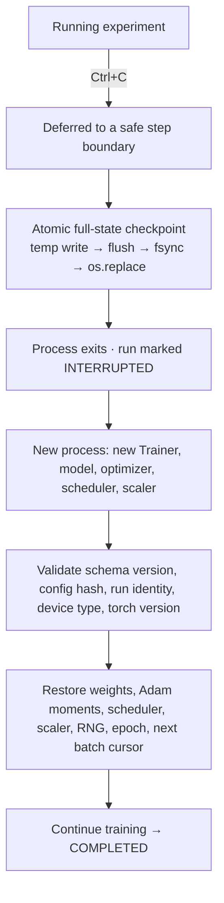
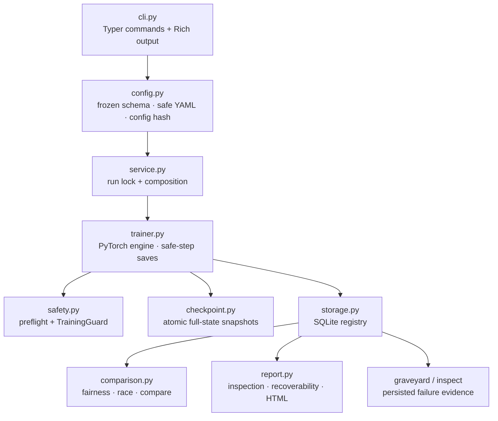

<div align="center">

# TorchArena

### Train. Race. Break. Resume.

A lightweight, reproducible PyTorch training workbench where models can compete,
interrupted experiments recover, and failed runs stay inspectable.

**English** · [简体中文](README.zh-CN.md)

[](https://github.com/kallist/torcharena/actions/workflows/ci.yml)


[](LICENSE)


*A ~22-second replay of the real, committed CLI transcripts in
[`artifacts/showcase/`](artifacts/showcase/), with editorial pacing. It is not a
new training run and not a speed benchmark.*

</div>

> **Most training scripts can save weights.**
> TorchArena asks a harder question:
> **can an experiment survive interruption — and still prove where it resumed?**

**Status:** `v0.1.0` · CPU-first · small, single-maintainer project. Every number and
capability on this page is either verified in this repository or explicitly marked
**NOT TESTED** / **NOT IMPLEMENTED**.

## Contents

- [Why TorchArena](#why-torcharena)
- [30-second tour](#30-second-tour)
- [Model Race](#model-race)
- [Crash → Resume](#crash--resume)
- [Failure Graveyard](#failure-graveyard)
- [Why not just save model weights?](#why-not-just-save-model-weights)
- [Features](#features)
- [Quick start](#quick-start)
- [Architecture](#architecture)
- [Experiment registry and reproducibility](#experiment-registry-and-reproducibility)
- [Verified behavior and evidence](#verified-behavior-and-evidence)
- [Project structure](#project-structure)
- [Docker and CI](#docker-and-ci)
- [Design decisions](#design-decisions)
- [Positioning](#positioning)
- [Use cases](#use-cases)
- [Limitations](#limitations)
- [Security](#security)
- [Roadmap](#roadmap)
- [Contributing](#contributing)
- [FAQ](#faq)
- [中文文档](#中文文档)
- [License and acknowledgements](#license-and-acknowledgements)

## Why TorchArena

`fit()` is one line. A *real* experiment is a lifecycle:

```text
preflight  →  train  →  interrupt  →  resume  →  fail  →  diagnose  →  compare  →  evidence
```

Most training code handles the second step well and leaves the rest to the operator.
TorchArena treats the whole lifecycle as the product: every run is a persisted experiment
with a full continuation state, an explicit attempt history, and a failure record that
outlives the traceback.

Six words describe the intent:

```text
reproducible · recoverable · inspectable · local-first · failure-aware · behavior-tested
```

## 30-second tour

```bash
torcharena doctor                 # environment and local store readiness (read-only)
torcharena showcase race          # two real models, measured comparison categories
torcharena showcase crash-resume  # interrupt → new objects → resume to completion
torcharena showcase graveyard     # a real failing run that stays inspectable
```

Each showcase executes genuine training through the same service path as a normal run.
Metrics are measured at execution time, not predefined. Exports land in
`artifacts/showcase/` as plain text, JSON and HTML; runtime state lives in `.torcharena/`.

## Model Race

🏁 **Two PyTorch models, one comparable setup, measured categories — and no invented champion.**


```bash
torcharena race examples/tiny_cnn.yaml examples/tiny_resnet.yaml
```

`TinyCNN` (with dropout) and `TinyResidualCNN` (residual convolution) train **sequentially**
on the same dataset, split, seed, batch size, epoch budget, device, AMP flag, determinism
setting and early-stopping policy. Learning rate stays an explicit per-model choice, not a
hidden tuning result. The command refuses contestants that are not comparable.

Results are reported as four independent categories taken from measured values:

```text
Highest accuracy · Lowest validation loss · Fastest measured training · Fewest parameters
```

A tie stays a tie: if both contestants reach the same accuracy, both are listed. No overall
winner is fabricated. Measured CPU values from the checked-in [`race.json`](artifacts/showcase/race.json)
(seed 42, 64 train / 32 validation samples, 4 epochs):

| Model | Validation accuracy | Validation loss | Fit time (s) | Parameters | Epochs |
| --- | ---: | ---: | ---: | ---: | ---: |
| `tiny_cnn` | 100.00% | 0.000079 | 0.381 | 554 | 4 |
| `tiny_resnet` | 100.00% | 0.000003 | 0.398 | 702 | 4 |

[Full terminal transcript](artifacts/showcase/race.txt) · [Measured JSON](artifacts/showcase/race.json) ·
[HTML report](artifacts/showcase/race.html) · [Comparison ADR](docs/ARCHITECTURE.md)

**Read this honestly:** the fixture is deliberately easy, so both models hit 100% accuracy —
it exists to exercise training and recovery, not to benchmark architectures. Fit time includes
preflight and checkpoint I/O and varies with host load and contestant order. `compare` can still
inspect older incompatible runs, but it marks them **NOT COMPARABLE** and produces no categories.

## Crash → Resume

♻️ **Interrupt training, throw the objects away, rebuild everything, continue — then prove the result matches.**


```bash
torcharena showcase crash-resume
# On your own run: press Ctrl+C, then use the run ID it prints
torcharena resume <run-id>
```

The demonstration interrupts real training at a safe step, releases the original
`Trainer`/model/optimizer, builds **fresh objects** with no in-memory reuse, restores the
persisted full state and finishes the remaining work. An uninterrupted baseline trains
alongside it so the outcome can be compared:

```text
RESTORED: model / optimizer / scheduler / scaler / RNG / batch cursor
RESUMED → COMPLETED · step 16
Baseline equivalence: PASS · max parameter error 0 · atol 1e-7
```



**Test evidence.** A parametrized behavioral test runs the same comparison at six interruption
points (steps 1, 3, 4, 5, 15 and 16), covering mid-epoch and epoch boundaries. It discards the
original objects, rebuilds a fresh `Trainer`, resumes, and then asserts equality of final
metrics, model tensors, optimizer state and scheduler state. A separate subprocess fixture
calls `os._exit(17)` mid-training; a brand-new CLI process then recovers under an exclusive OS
lock and finishes at step 16 — that is the cross-process recovery proof.

[Complete generated transcript](artifacts/showcase/crash-resume.txt) ·
[Recovery JSON](artifacts/showcase/crash-resume.json) ·
[HTML report](artifacts/showcase/crash-resume.html) ·
[Recovery contract](docs/RECOVERY.md)

**Recovery boundary.** SIGINT is deferred to a safe update/epoch boundary. A hard process kill
cannot be caught: recovery restarts from the last already-written `last.pt` and **repeats
uncheckpointed work**. Exact mid-epoch continuation is supported for the built-in deterministic
dataset only — no arbitrary `DataLoader`, and no cross-hardware bitwise guarantee.

## Failure Graveyard

☠ **Failure becomes data. Bad experiments deserve a proper funeral.**


```bash
torcharena showcase graveyard   # produce the demo failure
torcharena graveyard            # list FAILED and INTERRUPTED runs
torcharena inspect <run-id>     # full record: failure, traceback, attempts, recoverability
```

When training breaks, the run does not vanish into a traceback. TorchArena persists the failed
run with its failure condition, message, epoch, global step, traceback, attempt history and the
**last healthy checkpoint**, then verifies whether that run is still recoverable.

Persisted demo run `run-0f55a5ffea9b482fa45aad993e074553`: **FAILED** · `non_finite_loss` ·
failed at step 3 · last durable healthy step **2** · recoverable **YES**.

```text
Detected: non_finite_loss · Detected non_finite_loss; inspect data and learning rate
Last healthy checkpoint preserved; failure traceback persisted.
```

**This is an explicit, deterministic fault-injection demo** — a Python-only showcase hook puts
NaN into the next real training batch so the failure path can be demonstrated. It is not a
naturally occurring model bug, and normal `train` accepts no fault-injection fields or flags:
the YAML schema is closed and rejects them.

[Complete generated transcript](artifacts/showcase/graveyard.txt) ·
[Failure inspection JSON](artifacts/showcase/graveyard.json) ·
[HTML report](artifacts/showcase/graveyard.html) ·
[Failure/recovery contract](docs/RECOVERY.md)

## Why not just save model weights?

Because a weights file answers "what did the model look like?" — not "how do I continue this
experiment?".

```python
torch.save(model.state_dict(), "last.pt")   # weights only
```

That file cannot carry any of the state a continuation actually needs:

| Continuation state | Weights-only file | TorchArena checkpoint |
| --- | --- | --- |
| Model parameters | Stored | Stored |
| Adam optimizer moments | Not stored | Stored |
| Scheduler position (`StepLR`) | Not stored | Stored |
| AMP `GradScaler` state | Not stored | Stored |
| Python / NumPy / torch / CUDA RNG | Not stored | Stored |
| Epoch number and next batch cursor | Not stored | Stored |
| Partial-epoch loss/correct/sample totals | Not stored | Stored |
| Best metric, best epoch, bad-epoch count, early-stop flag | Not stored | Stored |
| Config hash, run identity, schema version, device type, torch version | Not stored | Stored |

TorchArena is designed around **training continuation**, not **model persistence**. Every field
in the table is validated on load: a config hash mismatch, a schema change, a different device
type or a different PyTorch version fails closed **before** the run's status is touched. The
complete list is in the [recovery contract](docs/RECOVERY.md).

## Features

```text
Config-driven experiments        Closed, frozen Pydantic schema; canonical JSON + SHA-256 config hash
Training preflight              Isolated temporary model/batch/backward/optimizer probe before training
TrainingGuard                   Finite loss, gradient and post-update parameter checks
Atomic full-state checkpoints   Temp write → flush → fsync → os.replace; previous snapshot survives a failed write
Mid-epoch recovery              Deterministic per-epoch batch order with a persisted next-batch cursor
SQLite experiment registry      runs · metrics · failures · transitions · races in one local file
Run inspection                  inspect: config, metrics, failures, attempts, recoverability
Run comparison                  compare: explicit NOT COMPARABLE handling for mismatched runs
Static HTML report              Self-contained battle report: metrics, loss curve, config hash, environment
Rich terminal UI                Tables and banners that stay readable with NO_COLOR=1
Docker                          CPU image running as an unprivileged user
GitHub Actions                  Python 3.11 + 3.12 CPU jobs, plus a Docker smoke job
CPU-first validation            67 tests with no GPU, no downloads, no credentials
```

Many of these are ordinary PyTorch-ecosystem capabilities — checkpointing, metrics, early
stopping and AMP are not inventions here. What TorchArena centers its design on is
**recovery semantics, experiment evidence and inspectable failures**, and it validates those
with behavioral tests rather than prose.

## Quick start

Requires Python 3.11 or 3.12. No GPU, account, API key or dataset download is needed.

```bash
git clone https://github.com/kallist/torcharena.git
cd torcharena

python -m venv .venv
source .venv/bin/activate          # Windows PowerShell: .\.venv\Scripts\Activate.ps1

# Install CPU PyTorch explicitly (avoids pulling a CUDA build on a CPU-only workflow)
python -m pip install torch==2.8.0 --index-url https://download.pytorch.org/whl/cpu
python -m pip install -e ".[dev]"

torcharena doctor
```

If you already have PyTorch 2.8.x installed, the CPU-index step can be skipped and
`pip install -e ".[dev]"` is enough. The CPU index deliberately installs CPU PyTorch even on a
machine with an NVIDIA GPU. NumPy is a dev dependency used by the RNG tests; the tensor-only
runtime works without it, though a minimal install may emit PyTorch's optional NumPy warning.

Run a first real experiment:

```bash
torcharena validate examples/tiny_cnn.yaml     # preflight only, no run created
torcharena train examples/tiny_cnn.yaml        # real Adam updates on the built-in fixture
torcharena runs                                # experiment history
torcharena report <run-id>                     # write a self-contained HTML report
```

Press `Ctrl+C` during `train` to see the recovery path: the run is marked `INTERRUPTED`, a safe
checkpoint is kept, and the exact resume command is printed.

> GitHub displays HTML files as source. Download a report from
> [`artifacts/showcase/`](artifacts/showcase/) and open it in a browser, or generate
> your own with `torcharena report`.

## Architecture



**How one run works**

1. `cli.py` parses the command and loads the YAML config through a strict, closed schema.
2. `service.py` creates the run record and takes a nonblocking OS lock on the run directory.
3. `trainer.py` builds the model and optimizer on the resolved device; `safety.py` then runs preflight
   on a temporary model while the run is in `VALIDATING`.
4. `trainer.py` trains with real Adam updates, saving atomically at safe boundaries and recording metrics.
5. `checkpoint.py` writes the full continuation state; `storage.py` records progress, metrics, failures and transitions.
6. `comparison.py` and `report.py` turn the registry into races, comparisons and static HTML evidence.

`trainer.py` has no SQLite or Rich imports: storage is an optional adapter, so the engine can be
tested independently. The same preflight also backs the standalone `torcharena validate` command,
which creates no run at all. The diagram traces the main path, not every import.
[Architecture and ADRs](docs/ARCHITECTURE.md)

## Experiment registry and reproducibility

By default, state lives in `.torcharena/` — a `torcharena.db` SQLite file plus `runs/<run-id>/`
directories. Each run stores its canonical config, seed and config hash, environment metadata
(Python, PyTorch, platform, device, CUDA, Git revision), status and progress, metrics, failures
and the full attempt history. JSON, YAML and JSONL exports stay human-readable; checkpoints
remain files, not database blobs.

```bash
TORCHARENA_HOME=/path/to/store          # choose another local store
TORCHARENA_SHOWCASE_DIR=path/to/exports # choose the showcase export directory
```

Resume continues the **same logical run** with an explicit transition history
(`CREATED → VALIDATING → RUNNING → COMPLETED | INTERRUPTED | FAILED`, and
`FAILED | INTERRUPTED → RESUMING → RUNNING`); `COMPLETED` is terminal. Per-run OS locks reject
concurrent ownership. SQLite uses foreign keys, a 5-second busy timeout and `BEGIN IMMEDIATE`
transition checks for ordinary local contention. If a crash happens between the checkpoint
replacement and the database write, the **checkpoint is authoritative** and metric history is
reconciled from it.

Deterministic mode seeds Python, NumPy (when installed), torch CPU and available CUDA RNGs and
requests deterministic kernels; `torch.set_num_threads(1)` is set for stable CPU behavior. Some
kernels or environments may reject deterministic mode, and GPU determinism can cost performance.
This is a local workflow: not a distributed system, not power-loss-proof, not a network-filesystem
guarantee. [Detailed guarantees](docs/RECOVERY.md)

## Verified behavior and evidence

| Validation | Result | Where the evidence lives |
| --- | --- | --- |
| 67 automated tests | PASS | `tests/` · [local validation record](docs/VALIDATION.md) |
| Python 3.11 Hosted CI job | PASS | [merged main run](https://github.com/kallist/torcharena/actions/runs/37044363967) |
| Python 3.12 Hosted CI job | PASS | same run |
| Docker Hosted CI job (build + `doctor` + tiny training) | PASS | same run |
| Fresh-object resume equivalence | PASS | 6 interruption points: steps 1, 3, 4, 5, 15, 16 |
| Hard-kill recovery (`os._exit(17)`) | PASS | `tests/test_cli.py`, fresh CLI process resumes to step 16 |
| Showcase max parameter error | `0` at `atol=1e-7` | on the documented deterministic CPU validation path |
| Local Docker build/run | NOT TESTED | Docker engine unavailable on the local machine |

**Scope of that evidence.** The 67 tests run on each Python 3.11/3.12 Hosted CPU job — 37 unit
cases, 20 training-behavior cases and 10 installed-CLI subprocess cases. The Docker
job builds the image and runs `doctor` plus tiny training — it does not run the test suite, and no
CUDA container was validated. `maximum parameter error 0` describes the documented deterministic
CPU validation path only: it is **not** a universal zero-error claim and **not** a cross-hardware
bitwise-reproducibility claim. One documented `StepLR` resume boundary emits an ordering warning
while state equivalence still passes; the assertions were not weakened to hide it.

```bash
ruff check .
ruff format --check .
pytest -q
python -m build
```

Behavioral tests prove parameter updates and real learning, fresh-object full-state roundtrip,
CPU uninterrupted-vs-resumed equality at six interruption points, SIGINT handling, hard process
exit, healthy-checkpoint survival, failure persistence and preflight isolation. Subprocess tests
invoke the installed console script. The tiny datasets need no downloads and no network.
[Evidence map](docs/PUBLIC_EVIDENCE.md) · [Executed local validation](docs/VALIDATION.md) ·
[Engineering review](docs/REVIEW.md)

## Project structure

```text
torcharena/
├── cli.py          # Typer commands: doctor, validate, train, resume, runs, inspect,
│                   #                 compare, race, graveyard, report, showcase
├── service.py      # Composition: run lock, SQLite + Trainer, train/resume entry points
├── trainer.py      # PyTorch loop: safe-step saves, deferred SIGINT, failure records
├── checkpoint.py   # Atomic full-state save and fail-closed load validation
├── storage.py      # SQLite registry: runs, metrics, failures, transitions, races
├── safety.py       # Preflight probe and TrainingGuard finiteness checks
├── config.py       # Frozen Pydantic schema, canonical JSON, config hash, safe YAML
├── runtime.py      # Seeding, RNG capture/restore, environment metadata
├── data.py         # Built-in deterministic dataset and per-epoch batch order
├── models.py       # TinyCNN / TinyResidualCNN factories
├── comparison.py   # Fairness checks, sequential race, comparison categories
├── report.py       # Inspection, recoverability probe, self-contained HTML report
├── showcase.py     # Scripted demos on real code paths (no prewritten metrics)
├── ui.py           # Rich tables and banners
└── locking.py      # Nonblocking per-run OS file lock

tests/              # 67 tests: 37 unit, 20 training-behavior, 10 installed-CLI subprocess
examples/           # tiny_cnn.yaml, tiny_resnet.yaml
docs/               # Architecture/ADRs, recovery contract, evidence, visual assets
artifacts/showcase/ # Recorded TXT/JSON/HTML exports from real showcase runs
scripts/            # Showcase asset generator (separate from runtime packaging)
```

## Docker and CI

```bash
docker build -t torcharena:local .
docker run --rm torcharena:local torcharena doctor
docker run --rm torcharena:local torcharena train /app/examples/tiny_cnn.yaml
```

The image is CPU-only, installs CPU PyTorch explicitly and runs as an unprivileged user.
The Dockerfile is **implemented and verified in Hosted CI**; local execution is **NOT TESTED**
because no Docker engine was reachable on the development machine. GitHub Actions defines
Python 3.11/3.12 CPU jobs (lint, format check, tests, build, three showcases) and a Docker smoke
job. The [merged V0.1 Hosted run](https://github.com/kallist/torcharena/actions/runs/37044363967)
passed all three jobs.

## Design decisions

| Decision | Why |
| --- | --- |
| SQLite instead of a service or cloud database | Zero-service local workflow; runs, metrics, failures, transitions and races fit one file |
| Sequential Model Race | Avoid CPU/GPU resource contention that would make a small comparison unreliable |
| Closed, hash-versioned config | Resume compatibility is unambiguous; every config change is rejected on resume |
| Full-state checkpoints | Real continuation semantics instead of weight persistence |
| Checkpoint authoritative over SQLite | A crash between file and database writes must not resurrect stale metric state |
| Bounded step snapshots plus `best.pt` | Recovery uses only `last.pt`; retained snapshots stay inspectable and small |
| Deterministic synthetic fixture for CI | Fast, offline validation with no downloads or credentials |
| CLI and static HTML instead of a web UI | Keep the training workflow lightweight; the terminal is the product surface |

[Architecture decision records](docs/ARCHITECTURE.md)

## Positioning

TorchArena is **not** trying to replace full training frameworks. PyTorch Lightning, Hugging Face
`Trainer` and torchkeras each solve different problems well: training convenience, model and API
abstraction, distributed scale, and ecosystem integration. TorchArena deliberately stays in a
smaller lane.

| | Full training frameworks | TorchArena V0.1 |
| --- | --- | --- |
| Primary goal | Convenient, scalable model training | Local experiment lifecycle with recovery evidence |
| Checkpointing | Framework-defined save/load | Full continuation state, atomic replace, config-hash bound |
| Failure handling | Exceptions and logging | `FAILED` runs persisted with condition, step, traceback, last healthy snapshot |
| Comparison | Dashboards and integrations | Sequential race with fairness checks and per-category results |
| Validation | Framework test suite | 67 behavioral tests including fresh-object resume equivalence |
| Scale | Distributed and multi-GPU | Single process, local files, CPU-first |

No superiority claim is made, and no production-readiness or universal reproducibility claim
either. Concepts were studied from [torchkeras](https://github.com/lyhue1991/torchkeras)
(Apache-2.0); no reference source, assets or notebooks were copied.
[Reference audit](docs/REFERENCE_AUDIT.md)

## Use cases

- Learning what a real PyTorch training loop actually contains — and what "resume" should mean.
- Small local experiments on CPU, offline, with no accounts or cloud services.
- Studying checkpoint semantics, interruption safety and recovery equivalence.
- Teaching or demonstrating experiment evidence and failure forensics.
- An ML-engineering portfolio piece that can be read, run and attacked.
- A CPU-first fixture for CI-style validation of training code.

**Not intended for:** large-scale or distributed production training, real-dataset accuracy work,
or replacing a full training framework.

## Limitations

Stated plainly, because a README that hides its boundaries is not useful:

- **CUDA / AMP path is not fully validated** in the current evidence. `training.device: cuda`
  exists and V0.1 AMP requires CUDA, but the installed PyTorch here is CPU-only and no GPU run
  is claimed.
- **Cross-hardware bitwise reproducibility is not claimed.** Equivalence is established on the
  documented deterministic CPU path.
- **Generic external `DataLoader` exact mid-epoch resume is not implemented.** Continuation is
  supported for the built-in deterministic dataset only.
- **DDP / distributed training is not implemented.** Concurrency control is a local OS file lock,
  not a distributed lock.
- **TorchArena full-state checkpoints are trusted inputs.**
- **`torch.load` deserialization is not sandboxed** — see [Security](#security).
- A hard process kill cannot be caught; uncheckpointed work is repeated, and a process that dies
  before its first snapshot cannot resume.
- Directory `fsync`, power-loss durability and network-filesystem behavior are not promised.
- Race timing is descriptive, not a controlled benchmark; there is no serialized model-size metric.
- One `StepLR` resume boundary emits a documented ordering warning (state equivalence still passes).
- No static type checker is configured; Ruff and strict config validation are not mypy evidence.
- No web UI, remote artifact backend, accounts or cloud integration.

## Security

**Only load TorchArena checkpoints that you created locally or obtained from a trusted source.**
Full-state loading uses ordinary PyTorch deserialization (`torch.load(..., weights_only=False)`)
because RNG and optimizer state must be restored; that path is **not a sandbox** and can execute
arbitrary code from a malicious file, exactly like any other PyTorch checkpoint.

What the project does do:

- Safe YAML loading with duplicate-key rejection, frozen strict schemas and explicit model/dataset
  registries — no config imports, `eval`, shell execution or dynamic loading.
- Parameterized SQL throughout, validated run IDs, and managed artifact paths confined to the store.
- Self-contained HTML reports that escape user-controlled content and load no CDN or scripts.
- No accounts, API keys, provider calls, telemetry or network egress at runtime.

What it does not claim: protection from a user who can already modify the local store, or
durability against storage and filesystem failure.

## Roadmap

V0.2 directions, in rough priority order. No dates are promised.

- **Replay** — re-run a recorded experiment from its config hash and seed.
- **CIFAR-10 / real-dataset showcase** — recovery evidence on data that is not synthetic.
- **GPU and AMP validation** — run the behavioral suite on CUDA hardware and record it.
- **External sampler resume protocol** — an explicit contract for resuming arbitrary `DataLoader`s.
- **Richer report visualization** — more than one measured curve, still self-contained.
- **Static type-checking gate** — mypy (or equivalent) in CI.

Explicitly out of scope for now: DDP, cloud services and a web UI.

## Contributing

Issues and small, focused pull requests are welcome. This is a small project maintained by one
person — there is no SLA, no corporate backing and no large community behind it.

Especially useful contributions:

- **Bug reports** with a command, a config and the observed output.
- **Cross-platform validation** — Linux and macOS runs of the test suite.
- **Recovery edge cases** — interruption points, corrupt checkpoints, unusual filesystems.
- **Documentation improvements**, including better Chinese documentation.

Before opening a PR:

```bash
ruff check .
ruff format --check .
pytest -q
```

Keep changes focused, keep the existing evidence honest, and do not add claims that the test
suite cannot support.

## FAQ

**Is TorchArena a replacement for PyTorch Lightning or Hugging Face `Trainer`?**
No. Those are full training frameworks with distributed scale and broad ecosystem integrations.
TorchArena is a small local workbench focused on the experiment lifecycle — recovery,
comparison and failure evidence.

**Why is Model Race sequential?**
Running contestants in parallel would create CPU/GPU resource contention and make a small
comparison unreliable. Ordering is a measurement decision, so the sequence is deliberate, and
fit times are reported as descriptive rather than as a benchmark.

**Can it resume any `DataLoader`?**
No. Exact mid-epoch continuation works on the built-in deterministic dataset, where batch order is
reproducible and the next-batch cursor is persisted. An explicit external-sampler protocol is on
the [roadmap](#roadmap).

**Does it support GPU?**
`training.device: cuda` and AMP are implemented in the code, but GPU execution is **NOT TESTED**
in the current evidence and AMP requires CUDA. Everything documented here was validated on CPU.

**Why SQLite?**
It gives a zero-service, single-file experiment registry with real transactions and foreign keys,
which suits a local single-trainer tool. Checkpoints stay as files; the database stores history.

**Are checkpoints safe to download and load?**
No. Treat them the way you treat any `torch.load` artifact: trusted sources only. Deserialization
is not sandboxed.

**What does "maximum parameter error 0" mean?**
In the recorded showcase, the resumed model's parameters matched the uninterrupted baseline
exactly, at `atol=1e-7`, on the documented deterministic CPU validation path. It is not a
guarantee for every hardware, dataset or `DataLoader`.

## 中文文档

中文读者可以直接阅读 **[README.zh-CN.md](README.zh-CN.md)**，内容包括项目亮点、三大核心场景
（模型竞速 / 中断恢复 / 失败实验墓地）、快速开始、恢复语义、证据与限制，以及面试与招聘视角的说明。

There is also a Chinese 90-second demo script: [docs/DEMO_SCRIPT_ZH.md](docs/DEMO_SCRIPT_ZH.md).

## License and acknowledgements

TorchArena original source is released under the [MIT License](LICENSE).

- Inspired by [torchkeras](https://github.com/lyhue1991/torchkeras) (Apache-2.0) — a Keras-style
  PyTorch training template; no reference source, assets or notebooks were copied.
- Determinism guidance from the
  [PyTorch reproducibility notes](https://docs.pytorch.org/docs/2.8/notes/randomness.html).
- Showcase visuals are generated from the committed real CLI transcripts.
  [Asset provenance](docs/assets/provenance.json) · [Asset guide](docs/assets/README.md) ·
  [social preview](docs/assets/social-preview.png)

No superiority, production-readiness, adoption or universal bitwise-reproducibility claim is made.
Ancillary project documents: [public evidence map](docs/PUBLIC_EVIDENCE.md) ·
[executed validation](docs/VALIDATION.md) · [engineering review](docs/REVIEW.md) ·
[repository audit](docs/REPOSITORY_AUDIT.md) · [presentation validation](docs/PRESENTATION_VALIDATION.md) ·
[portfolio copy](docs/RESUME_COPY.md) · [GitHub presentation settings](docs/GITHUB_PROFILE.md)

[Back to top](#torcharena)
