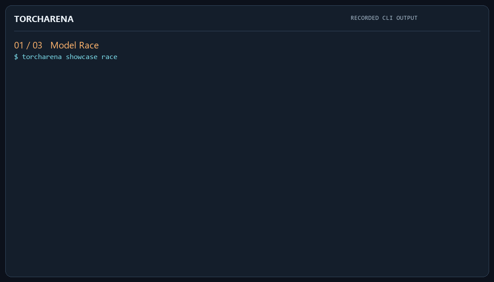
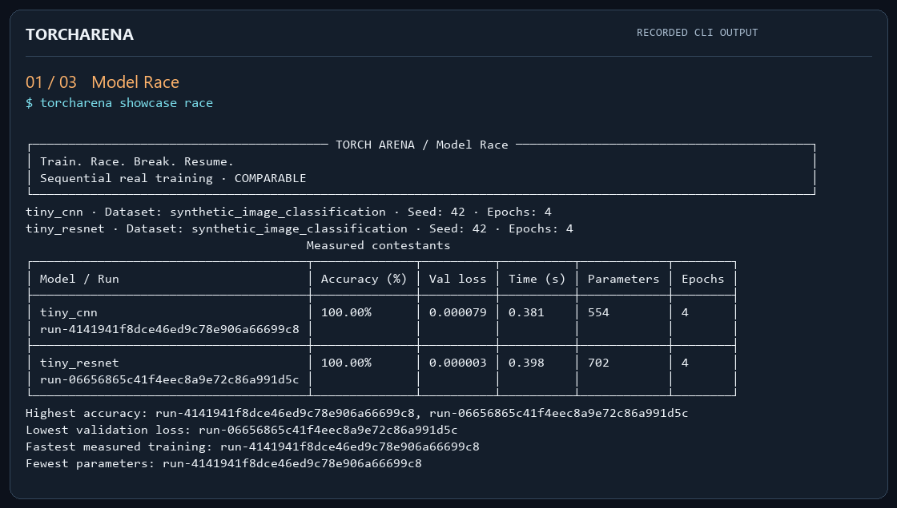
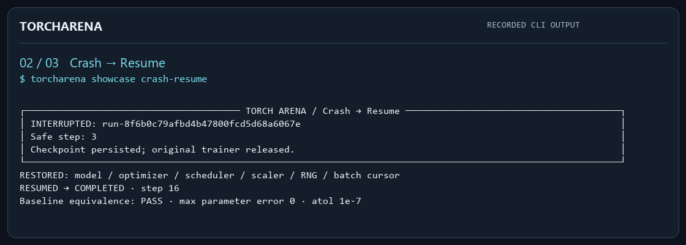
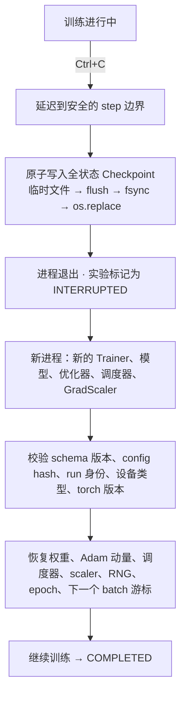
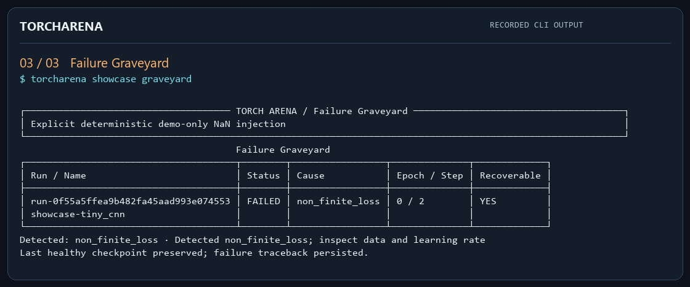
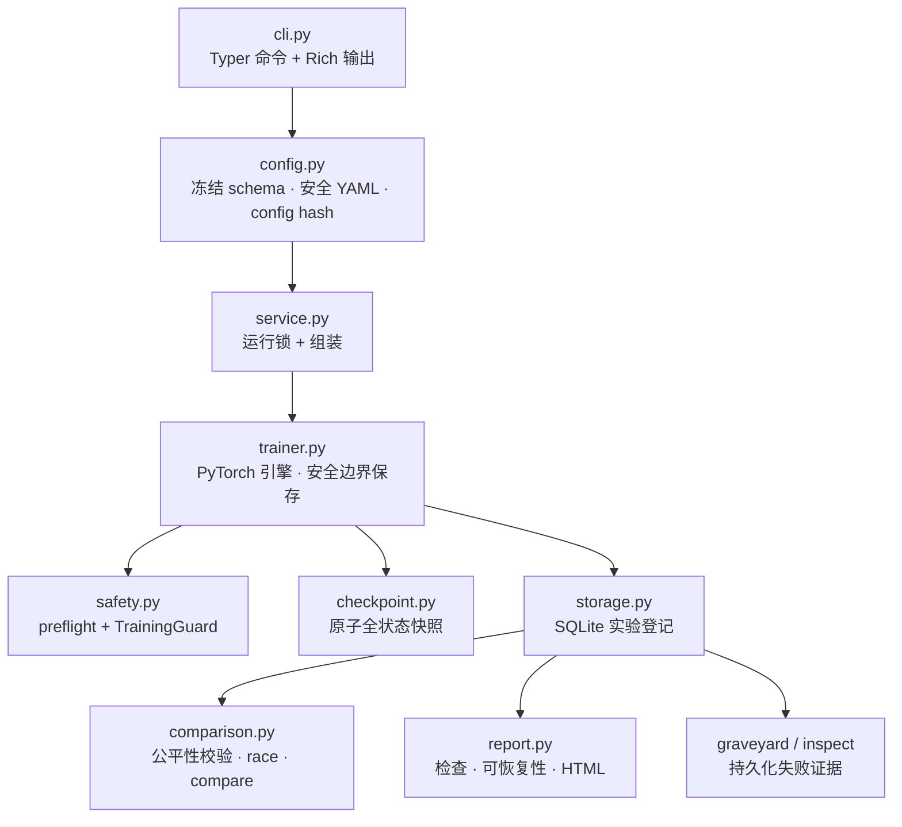

<div align="center">

# TorchArena

### Train. Race. Break. Resume.

一个轻量、可复现的 PyTorch 训练工作台：
让模型可以竞速、训练可以中断恢复，失败实验也能留下完整证据。

[English](README.md) · **简体中文**

[](https://github.com/kallist/torcharena/actions/workflows/ci.yml)


[](LICENSE)



*约 22 秒的录屏回放，素材来自仓库中真实提交的 CLI 终端记录，节奏经过剪辑。
它不是重新跑出来的训练结果，也不是性能测试。*

</div>

> **大多数训练脚本会保存模型权重。**
> TorchArena 更关心另一个问题：
> **训练中断以后，这场实验能不能真正恢复，并且证明它是从正确的位置继续的？**

**项目状态：** `v0.1.0` · CPU 优先 · 单人维护的小型项目。本文档里的每一个数字和能力，
要么能在仓库里被验证，要么被明确标注为 **NOT TESTED** / **NOT IMPLEMENTED**。

## 目录

- [项目亮点](#项目亮点)
- [30 秒上手](#30-秒上手)
- [三大核心场景](#三大核心场景)
- [为什么只保存权重不够](#为什么只保存权重不够)
- [快速开始](#快速开始)
- [架构与工作方式](#架构与工作方式)
- [实验登记与可复现性](#实验登记与可复现性)
- [验证证据](#验证证据)
- [目录结构](#目录结构)
- [设计取舍](#设计取舍)
- [适用场景](#适用场景)
- [已知限制](#已知限制)
- [安全说明](#安全说明)
- [路线图](#路线图)
- [参与贡献](#参与贡献)
- [常见问题](#常见问题)
- [English](#english)

## 项目亮点

- **全状态 Checkpoint 与中断恢复**：模型权重、Adam 动量、调度器、GradScaler、Python / NumPy / torch / CUDA 随机数状态、epoch 与下一个 batch 游标一起保存与恢复。
- **6 个中断位置的恢复等价测试**：在 step 1 / 3 / 4 / 5 / 15 / 16 处打断训练，丢弃原有对象、重建全新的 `Trainer`，再断言指标、模型张量、优化器与调度器状态完全一致。
- **模型竞速（Model Race）**：两个真实 PyTorch 模型在统一条件下顺序训练，分别给出「最高准确率 / 最低验证损失 / 最快训练 / 最少参数」四类结果，不制造虚假总冠军。
- **失败实验墓地（Failure Graveyard）**：失败条件、报错信息、epoch 与 step、traceback、最后一次健康快照全部持久化，`torcharena graveyard` 一条命令可查。
- **工程验证**：67 项自动化测试；Python 3.11 / 3.12 与 Docker 的 Hosted CI 全部通过（证据范围见[验证证据](#验证证据)）；CPU 优先，无需 GPU、无需下载数据集、无需账号或密钥。

招聘者与面试官视角的简历表述和边界说明见 [docs/RESUME_COPY.md](docs/RESUME_COPY.md)。

## 30 秒上手

```bash
torcharena doctor                 # 只读检查：运行环境与本地存储可用性
torcharena showcase race          # 两个真实模型竞速，输出实测对比分类
torcharena showcase crash-resume  # 中断 → 全新对象 → 恢复训练至完成
torcharena showcase graveyard     # 一次真实失败，并以可查证据留存
```

三个 showcase 走的都是和普通训练完全相同的服务路径，指标是执行时实测出来的，不是预先写死的。
导出结果落在 `artifacts/showcase/`（纯文本 / JSON / HTML），运行状态默认存放在 `.torcharena/`。

## 三大核心场景

### 模型竞速（Model Race）

🏁 **两个 PyTorch 模型，同一套可比条件，四类实测结果 —— 但没有被编造出来的冠军。**



```bash
torcharena race examples/tiny_cnn.yaml examples/tiny_resnet.yaml
```

`TinyCNN`（带 dropout）和 `TinyResidualCNN`（残差卷积）在**同一数据集、同一划分、同一随机种子、
同一 batch size、同一 epoch 预算、同一设备、同一 AMP 与确定性设置、同一早停策略**下顺序训练。
学习率被当作模型本身的显式配置，而不是隐藏的调参结果。条件不可比的配置会被直接拒绝。

结果按四类**相互独立**的实测值分别给出：

```text
Highest accuracy · Lowest validation loss · Fastest measured training · Fewest parameters
```

并列就是并列：两个模型都达到相同准确率时，两个都会被列出，不会硬凑一个总冠军。
仓库中 [`race.json`](artifacts/showcase/race.json) 的实测 CPU 数值（seed 42，64 训练 / 32 验证样本，4 epoch）：

| 模型 | 验证准确率 | 验证损失 | 训练耗时 (s) | 参数量 | Epoch |
| --- | ---: | ---: | ---: | ---: | ---: |
| `tiny_cnn` | 100.00% | 0.000079 | 0.381 | 554 | 4 |
| `tiny_resnet` | 100.00% | 0.000003 | 0.398 | 702 | 4 |

[完整终端记录](artifacts/showcase/race.txt) · [实测 JSON](artifacts/showcase/race.json) ·
[HTML 报告](artifacts/showcase/race.html)

**需要说清楚的边界：** 这个数据集是刻意做成易学的，所以两个模型都到了 100% 准确率 ——
它的作用是验证训练与恢复流程，而不是给模型结构做 benchmark。耗时包含 preflight 和 checkpoint
写入，会随机器负载和出场顺序变化。`compare` 也可以查看历史的不兼容实验，但会明确标成
**NOT COMPARABLE**，并且不产生任何分类结果。

### 中断恢复（Crash → Resume）

♻️ **打断训练，丢掉内存里的对象，全部重建，然后继续 —— 并且证明结果和「从未中断」一致。**



```bash
torcharena showcase crash-resume
# 训练自己的实验时：按 Ctrl+C，然后使用它打印出的 run ID
torcharena resume <run-id>
```

这个演示会在安全的位置真实打断训练，释放原来的 `Trainer` / 模型 / 优化器，
然后**丢弃原有对象、重新构造全新的对象**（不复用任何内存对象），加载持久化的全状态，把剩下的训练跑完。
同时还会训练一个「从未中断」的基线，用来做结果对比：

```text
RESTORED: model / optimizer / scheduler / scaler / RNG / batch cursor
RESUMED → COMPLETED · step 16
Baseline equivalence: PASS · max parameter error 0 · atol 1e-7
```



**测试证据。** 一个参数化行为测试在 **6 个中断位置**（step 1、3、4、5、15、16，覆盖 epoch 中间
与 epoch 边界）重复整套对比：丢弃原对象、重建全新 `Trainer`、恢复训练，然后断言最终指标、模型张量、
优化器状态与调度器状态完全相等。另有一个独立子进程用例调用 `os._exit(17)` 模拟硬退出，
再由一个全新的 CLI 进程在独占文件锁下恢复，并训练到 step 16。

[完整终端记录](artifacts/showcase/crash-resume.txt) · [恢复 JSON](artifacts/showcase/crash-resume.json) ·
[HTML 报告](artifacts/showcase/crash-resume.html) · [恢复契约](docs/RECOVERY.md)

**恢复边界。** SIGINT 会被推迟到安全的更新 / epoch 边界；硬杀进程无法被捕获，
恢复只能从最后一个已写入的 `last.pt` 继续，**未写入 checkpoint 的工作会被重做**。
精确的 epoch 中间续训只在内置的确定性数据集上成立 —— 不支持任意 `DataLoader`，
也不承诺跨硬件位级一致。

### 失败实验墓地（Failure Graveyard）

☠ **失败也会变成数据。失败的实验值得一场体面的葬礼。**



```bash
torcharena showcase graveyard   # 产生这次演示失败
torcharena graveyard            # 列出 FAILED 与 INTERRUPTED 实验
torcharena inspect <run-id>     # 完整记录：失败信息、traceback、状态迁移、可恢复性
```

训练炸掉时，这次实验不会只消失在 traceback 里。TorchArena 会把失败实验连同失败条件、
报错信息、epoch、global step、traceback、状态迁移历史和**最后一次健康 Checkpoint** 一起持久化，
并检查这次实验现在是否仍然可恢复。

仓库中持久化的演示实验 `run-0f55a5ffea9b482fa45aad993e074553`：
**FAILED** · `non_finite_loss` · 在第 3 步失败 · 最后一个健康的持久化 step 为 **2** · 可恢复 **YES**。

```text
Detected: non_finite_loss · Detected non_finite_loss; inspect data and learning rate
Last healthy checkpoint preserved; failure traceback persisted.
```

**这是一次显式、确定性的故障注入演示** —— 由只在 Python 层存在的 showcase hook 把 NaN 注入下一个真实
训练 batch，用来演示失败路径。它不是自然产生的模型 bug；普通 `train` 不接受任何故障注入字段或开关，
YAML schema 是封闭的，会直接拒绝这类字段。

[完整终端记录](artifacts/showcase/graveyard.txt) · [失败检查 JSON](artifacts/showcase/graveyard.json) ·
[HTML 报告](artifacts/showcase/graveyard.html)

## 为什么只保存权重不够

因为权重文件回答的是「模型长什么样」，而不是「这次实验怎么继续」。

```python
torch.save(model.state_dict(), "last.pt")   # 只有权重
```

这个文件带不走继续训练真正需要的任何状态：

| 续训所需状态 | 只有权重的文件 | TorchArena Checkpoint |
| --- | --- | --- |
| 模型参数 | 有 | 有 |
| Adam 优化器动量 | 没有 | 有 |
| 调度器位置（`StepLR`） | 没有 | 有 |
| AMP `GradScaler` 状态 | 没有 | 有 |
| Python / NumPy / torch / CUDA 随机数状态 | 没有 | 有 |
| epoch 与下一个 batch 游标 | 没有 | 有 |
| epoch 中间未完成的 loss / 正确数 / 样本数累计 | 没有 | 有 |
| 最优指标、最优 epoch、坏 epoch 计数、早停标志 | 没有 | 有 |
| config hash、run 身份、schema 版本、设备类型、torch 版本 | 没有 | 有 |

TorchArena 是围绕**续训（training continuation）**设计的，而不是围绕**模型持久化（model persistence）**。
上表每一项在加载时都会被校验：config hash 不匹配、schema 变化、设备类型不同、PyTorch 版本不同，
都会在**改动实验状态之前**直接失败关闭（fail closed）。完整清单见[恢复契约](docs/RECOVERY.md)。

## 快速开始

需要 Python 3.11 或 3.12。不需要 GPU、账号、API Key，也不需要下载数据集。

```bash
git clone https://github.com/kallist/torcharena.git
cd torcharena

python -m venv .venv
source .venv/bin/activate          # Windows PowerShell: .\.venv\Scripts\Activate.ps1

# 显式安装 CPU 版 PyTorch，避免在纯 CPU 工作流里拉取 CUDA 构建
python -m pip install torch==2.8.0 --index-url https://download.pytorch.org/whl/cpu
python -m pip install -e ".[dev]"

torcharena doctor
```

如果你已经装好了 PyTorch 2.8.x，可以跳过 CPU 索引那一步，直接 `pip install -e ".[dev]"`。
CPU 索引会刻意安装 CPU 版 PyTorch，即使在有 NVIDIA 显卡的机器上也是如此。
NumPy 是 dev 依赖，用于随机数相关测试；纯张量运行时没有它也能工作，
但最小化安装时可能会看到 PyTorch 关于可选 NumPy 的提示。

跑第一个真实实验：

```bash
torcharena validate examples/tiny_cnn.yaml     # 只做 preflight，不创建实验
torcharena train examples/tiny_cnn.yaml        # 在内置数据集上做真实 Adam 更新
torcharena runs                                # 查看实验历史
torcharena report <run-id>                     # 生成自包含的 HTML 报告
```

在 `train` 过程中按 `Ctrl+C` 就能看到恢复路径：实验被标记为 `INTERRUPTED`，
安全 Checkpoint 被保留，并打印出准确的恢复命令。

> GitHub 会把 HTML 文件当源码展示。可以下载 [`artifacts/showcase/`](artifacts/showcase/)
> 里的报告用浏览器打开，也可以用 `torcharena report` 生成自己的。

## 架构与工作方式



**一次实验的完整流程**

1. `cli.py` 解析命令，并通过严格封闭的 schema 加载 YAML 配置。
2. `service.py` 创建实验记录，并对实验目录加非阻塞 OS 文件锁。
3. `trainer.py` 在解析出的设备上构造模型与优化器；随后 `safety.py` 在 `VALIDATING` 状态下用临时模型做 preflight（张量形状、loss、反向传播、优化器步进）。
4. `trainer.py` 用真实 Adam 更新训练，在安全边界原子保存，并记录指标。
5. `checkpoint.py` 写入完整续训状态；`storage.py` 记录进度、指标、失败与状态迁移。
6. `comparison.py` 与 `report.py` 把登记表变成竞速结果、对比结果和静态 HTML 证据。

`trainer.py` 不导入 SQLite 和 Rich：存储只是可选适配器，因此训练引擎可以独立测试。
同一套 preflight 也支撑独立的 `torcharena validate` 命令 —— 它完全不创建实验记录。
图中的箭头表示主路径，而不是全部 import 关系。
详见[架构与 ADR](docs/ARCHITECTURE.md)。

## 实验登记与可复现性

默认状态存放在 `.torcharena/`：一个 `torcharena.db` SQLite 文件，加上 `runs/<run-id>/` 目录。
每个实验都会记录规范化配置、随机种子与 config hash、环境元数据（Python、PyTorch、平台、设备、
CUDA、Git revision）、状态与进度、指标、失败信息和完整的状态迁移历史。JSON / YAML / JSONL
都是可读导出；Checkpoint 始终是文件，不作为数据库大字段存储。

```bash
TORCHARENA_HOME=/path/to/store          # 指定其他本地存储目录
TORCHARENA_SHOWCASE_DIR=path/to/exports # 指定 showcase 导出目录
```

恢复操作延续的是**同一个逻辑实验**，并留下显式的状态迁移历史
（`CREATED → VALIDATING → RUNNING → COMPLETED | INTERRUPTED | FAILED`，
以及 `FAILED | INTERRUPTED → RESUMING → RUNNING`），`COMPLETED` 是终态。
每个实验目录上的 OS 文件锁会拒绝并发占用；SQLite 使用外键、5 秒 busy timeout 和
`BEGIN IMMEDIATE` 迁移校验来应对常见的本地争用。如果进程在 Checkpoint 替换和数据库写入之间崩溃，
**以 Checkpoint 为准**，并从它重建指标历史。

确定性模式会为 Python、NumPy（已安装时）、torch CPU 和可用的 CUDA 设置随机种子并请求确定性算子，
同时设置 `torch.set_num_threads(1)` 以获得稳定的 CPU 行为。部分算子或环境可能拒绝确定性模式，
GPU 上的确定性也可能带来性能损失。这是一个本地工作流：不是分布式系统，不承诺掉电安全，
也不承诺网络文件系统上的行为。[详细保证](docs/RECOVERY.md)

## 验证证据

| 验证项 | 结果 | 证据位置 |
| --- | --- | --- |
| 67 项自动化测试 | PASS | `tests/` · [本地验证记录](docs/VALIDATION.md) |
| Python 3.11 Hosted CI | PASS | [已合并的 main 运行](https://github.com/kallist/torcharena/actions/runs/37044363967) |
| Python 3.12 Hosted CI | PASS | 同一次运行 |
| Docker Hosted CI（build + `doctor` + tiny 训练） | PASS | 同一次运行 |
| 重建对象后的恢复等价 | PASS | 6 个中断位置：step 1、3、4、5、15、16 |
| 硬退出恢复（`os._exit(17)`） | PASS | `tests/test_cli.py`，全新 CLI 进程恢复到 step 16 |
| showcase 最大参数误差 | `0`，`atol=1e-7` | 仅在文档所述确定性 CPU 验证路径上 |
| 本地 Docker 构建 / 运行 | NOT TESTED | 本机无法访问 Docker 引擎 |

**证据范围。** 这 67 项测试在 Python 3.11 和 3.12 的 Hosted CPU job 上各跑一遍 ——
其中 37 项单元用例、20 项训练行为用例、10 项安装后 CLI 子进程用例。
Docker job 只做镜像构建、`doctor` 和 tiny 训练，**不跑测试套件**，也没有验证过 CUDA 容器。
`最大参数误差 0` 只描述文档所述的确定性 CPU 验证路径：它**不是**普遍零误差的承诺，
也**不是**跨硬件位级可复现的承诺。有一个已记录的 `StepLR` 恢复边界会输出顺序警告，
但状态等价断言依然通过 —— 没有为了让警告消失而削弱任何断言。

```bash
ruff check .
ruff format --check .
pytest -q
python -m build
```

行为测试覆盖：参数确实更新、模型确实在学习、重建对象的全状态往返、6 个中断位置下
「未中断 vs 恢复」的 CPU 等价性、SIGINT 处理、硬退出、健康 Checkpoint 存活、失败持久化
以及 preflight 隔离。子进程用例会调用安装后的命令行入口。所有数据集都是内置的，
不需要联网下载。[证据地图](docs/PUBLIC_EVIDENCE.md) · [本地验证记录](docs/VALIDATION.md) ·
[工程自审](docs/REVIEW.md)

## 目录结构

```text
torcharena/
├── cli.py          # Typer 命令：doctor, validate, train, resume, runs, inspect,
│                   #              compare, race, graveyard, report, showcase
├── service.py      # 组装层：运行锁、SQLite + Trainer、train / resume 入口
├── trainer.py      # PyTorch 训练循环：安全边界保存、延迟 SIGINT、失败记录
├── checkpoint.py   # 原子全状态写入与「失败关闭」式加载校验
├── storage.py      # SQLite 登记表：runs / metrics / failures / transitions / races
├── safety.py       # Preflight 探测与 TrainingGuard 有限性检查
├── config.py       # 冻结的 Pydantic schema、规范化 JSON、config hash、安全 YAML
├── runtime.py      # 随机种子、RNG 捕获 / 恢复、环境元数据
├── data.py         # 内置确定性数据集与按 epoch 的 batch 顺序
├── models.py       # TinyCNN / TinyResidualCNN 工厂
├── comparison.py   # 公平性校验、顺序竞速、对比分类
├── report.py       # 实验检查、可恢复性探测、自包含 HTML 报告
├── showcase.py     # 走真实代码路径的演示脚本（指标不预写）
├── ui.py           # Rich 表格与横幅
└── locking.py      # 非阻塞的每实验 OS 文件锁

tests/              # 67 项测试：37 单元 + 20 训练行为 + 10 安装后 CLI 子进程
examples/           # tiny_cnn.yaml、tiny_resnet.yaml
docs/               # 架构 / ADR、恢复契约、证据文档、视觉素材
artifacts/showcase/ # 真实 showcase 运行导出的 TXT / JSON / HTML
scripts/            # showcase 视觉素材生成器（与运行时打包无关）
```

## 设计取舍

| 取舍 | 原因 |
| --- | --- |
| 用 SQLite 而不是服务化 / 云数据库 | 零服务本地工作流；runs、metrics、failures、transitions、races 一个文件就够 |
| 模型竞速采用顺序执行的方式 | 避免 CPU / GPU 资源争用让小型对比结果失真 |
| 封闭且带 hash 的配置 | 续训兼容性无歧义；续训时拒绝任何配置变更 |
| 全状态 Checkpoint | 得到真正的续训语义，而不只是保存权重 |
| Checkpoint 优先于 SQLite | 文件与数据库提交之间崩溃时，不能复活过期的指标状态 |
| 有限数量的 step 快照加 `best.pt` | 恢复只用 `last.pt`；保留的快照便于检查且体积可控 |
| CI 使用确定性合成数据集 | 快速、离线、无需下载与凭证 |
| CLI 加静态 HTML，而不是 Web UI | 保持训练流程轻量；终端就是产品界面 |

[架构决策记录](docs/ARCHITECTURE.md)

## 适用场景

- 想搞清楚一个真实的 PyTorch 训练循环里到底有什么，以及「恢复」应该意味着什么。
- 在 CPU 上离线做小型实验，不需要账号和云服务。
- 研究 checkpoint 语义、中断安全性和恢复等价性。
- 教学或演示实验证据与失败取证。
- 一个可以被阅读、被运行、被挑刺的 ML 工程作品集项目。
- 作为验证训练代码的 CPU 优先 CI 夹具。

**不适用：** 大规模或分布式生产训练、真实数据集上的精度调优，以及替代完整训练框架。

## 已知限制

边界写清楚，因为一个隐藏自身边界的 README 没有太大价值：

- **CUDA / AMP 路径在当前证据中尚未完整验证。** `training.device: cuda` 在代码中存在，
  且 V0.1 的 AMP 需要 CUDA，但本机安装的是 CPU 版 PyTorch，没有任何 GPU 运行结论。
- **不承诺跨硬件位级可复现。** 等价性是在文档所述的确定性 CPU 路径上得到的。
- **通用外部 `DataLoader` 的精确 epoch 中间续训尚未实现。** 续训只支持内置的确定性数据集。
- **DDP / 分布式训练尚未实现。** 并发控制是本地 OS 文件锁，不是分布式锁。
- **TorchArena 的全状态 Checkpoint 属于受信任输入。**
- **`torch.load` 反序列化不是沙箱** —— 见[安全说明](#安全说明)。
- 硬杀进程无法被捕获：未写入 Checkpoint 的工作会被重做；如果进程在第一次快照之前就死掉，则无法恢复。
- 不承诺目录 `fsync`、掉电持久性和网络文件系统上的行为。
- 竞速耗时只是描述性的，不是受控 benchmark；也没有序列化模型体积这一指标。
- 有一个 `StepLR` 恢复边界会输出已记录的顺序警告（状态等价仍然通过）。
- 没有配置静态类型检查器；Ruff 与严格配置校验不能当作 mypy 证据。
- 没有 Web UI、远程产物后端、账号体系或云集成。

## 安全说明

**只加载你自己在本机生成的、或来自可信来源的 TorchArena Checkpoint。**
全状态加载使用普通的 PyTorch 反序列化（`torch.load(..., weights_only=False)`），
因为需要恢复 RNG 与优化器状态；这条路径**不是沙箱**，恶意文件可以像任何其他 PyTorch
Checkpoint 一样执行任意代码。

项目实际做到的事情：

- 安全 YAML 加载并拒绝重复键，冻结的严格 schema 与显式的模型 / 数据集注册表 ——
  配置不能 import、`eval`、执行 shell，也不能动态加载。
- 全程参数化 SQL，校验 run ID 格式，并把产物路径限制在存储目录之内。
- 自包含 HTML 报告：转义用户可控内容，不加载任何 CDN 或脚本。
- 运行时没有账号、API Key、外部服务调用、遥测或网络请求。

不宣称的部分：无法防护已经能修改本地存储的用户，也不承诺对抗存储与文件系统故障。

## 路线图

V0.2 方向，按大致优先级排列，不承诺任何日期。

- **Replay** —— 依据 config hash 与随机种子重放一次已记录实验。
- **CIFAR-10 / 真实数据集 showcase** —— 在非合成数据上给出恢复证据。
- **GPU 与 AMP 验证** —— 在 CUDA 硬件上运行行为测试套件并记录结果。
- **外部 sampler 恢复协议** —— 为任意 `DataLoader` 的续训定义显式契约。
- **更丰富的报告可视化** —— 不止一条实测曲线，仍然保持自包含。
- **静态类型检查门禁** —— 在 CI 中接入 mypy 或等价工具。

目前明确不在范围内：DDP、云服务和 Web UI。

## 参与贡献

欢迎提 Issue 和聚焦的小型 PR。这是一个单人维护的小项目 —— 没有 SLA，没有公司背书，
背后也没有一个大型社区。

特别欢迎以下几类贡献：

- **Bug 报告**：附上命令、配置和实际输出。
- **跨平台验证**：在 Linux 和 macOS 上跑一遍测试套件。
- **恢复边界用例**：更多中断位置、损坏的 Checkpoint、异常文件系统。
- **文档改进**，包括更好的中文文档。

提 PR 之前请先跑：

```bash
ruff check .
ruff format --check .
pytest -q
```

请保持改动聚焦，保持已有证据的诚实性，不要添加测试套件无法支撑的结论。

## 常见问题

**TorchArena 是要替代 PyTorch Lightning 或 Hugging Face `Trainer` 吗？**
不是。它们是完整的训练框架，覆盖分布式规模和广泛的生态集成。TorchArena 是一个本地小型工作台，
关注实验生命周期 —— 恢复、对比和失败证据。

**为什么模型竞速是顺序执行的？**
并行跑参赛模型会引入 CPU / GPU 资源争用，让小型对比结果不可靠。执行顺序本身就是测量决策，
所以顺序是刻意设计的，耗时也只作为描述性信息给出，而不是 benchmark。

**能恢复任意 `DataLoader` 吗？**
不能。精确的 epoch 中间续训只在内置确定性数据集上成立：它的 batch 顺序可复现，
并且下一个 batch 游标会被持久化。外部 sampler 协议在[路线图](#路线图)里。

**支持 GPU 吗？**
代码里有 `training.device: cuda` 和 AMP 实现，但当前证据中 GPU 执行是 **NOT TESTED**，
且 AMP 需要 CUDA。本文档记录的一切都在 CPU 上验证。

**为什么用 SQLite？**
它提供一个零服务、单文件的实验登记表，具备真实事务和外键，很适合本地单训练器工具。
Checkpoint 仍然以文件形式存在，数据库负责保存历史。

**下载来的 Checkpoint 可以直接加载吗？**
不可以。请按对待任何 `torch.load` 产物的方式对待它：只加载可信来源。反序列化不是沙箱。

**「最大参数误差 0」是什么意思？**
在那次已记录的 showcase 中，恢复后的模型参数与未中断基线完全一致，容差为 `atol=1e-7`，
并且是在文档所述的确定性 CPU 验证路径上得到的。它不是对任意硬件、数据集或 `DataLoader` 的保证。

## English

The primary documentation is in English: **[README.md](README.md)** — covering the same
material with the full architecture, evidence map and limitations.
A 90-second Chinese demo script lives in [docs/DEMO_SCRIPT_ZH.md](docs/DEMO_SCRIPT_ZH.md).

## 许可与致谢

TorchArena 原创源码以 [MIT 协议](LICENSE) 发布。

- 设计思路上参考过 [torchkeras](https://github.com/lyhue1991/torchkeras)（Apache-2.0，
  Keras 风格的 PyTorch 训练模板）；没有复制其源码、素材或 notebook。
- 确定性相关说明参考
  [PyTorch 可复现性文档](https://docs.pytorch.org/docs/2.8/notes/randomness.html)。
- showcase 视觉素材由仓库中真实提交的 CLI 终端记录生成。
  [素材来源校验](docs/assets/provenance.json) · [素材说明](docs/assets/README.md) ·
  [社交预览图](docs/assets/social-preview.png)

不宣称任何优越性、生产可用性、用户规模或普遍位级可复现性。
其他项目文档：[公开证据地图](docs/PUBLIC_EVIDENCE.md) · [本地验证记录](docs/VALIDATION.md) ·
[工程自审](docs/REVIEW.md) · [仓库审计](docs/REPOSITORY_AUDIT.md) ·
[展示层验证](docs/PRESENTATION_VALIDATION.md) · [简历表述](docs/RESUME_COPY.md) ·
[GitHub 展示设置](docs/GITHUB_PROFILE.md)

[回到顶部](#torcharena)
